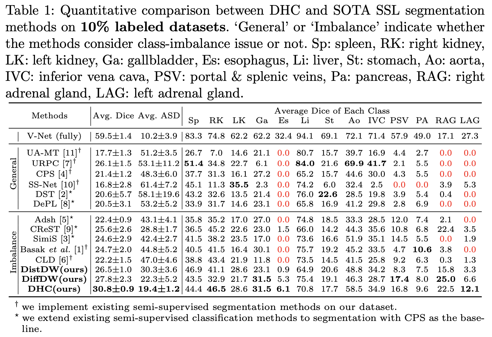
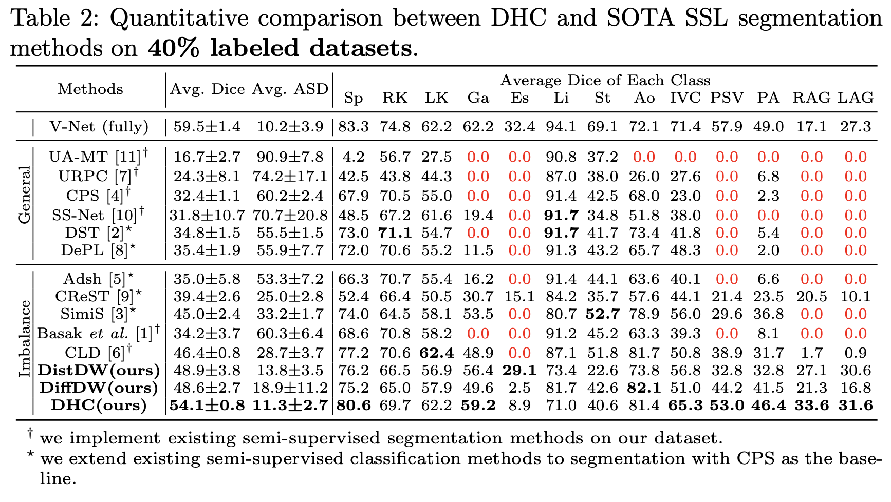

## DHC (Dual-debiased Heterogeneous Co-training Framework)


### 1. Environment

This code has been tested with Python 3.6, PyTorch 1.8, torchvision 0.9.0, and CUDA 11.1 on Ubuntu 20.04.

### 2. Data Preparation

#### 2.1 Synapse
The MR imaging scans are available at https://www.synapse.org/#!Synapse:syn3193805/wiki/.
Please sign up and download the dataset. 

Put the data in anywhere you want then change the file paths in `config.py`.

Run `./code/data/preprocess.py` to 
- convert `.nii.gz` files into `.npy` for faster loading. 
- generate the train/validation/test splits
- generate the labeled/unlabeled splits 

Or use our pre-split files in `./synapse/splits/*.txt`. 

After preprocessing, the `./synapse_data/` folder should be organized as follows:

```shell
./synapse_data/
├── npy
│   ├── <id>_image.npy
│   ├── <id>_label.npy
├── splits
│   ├── labeled_20p.txt
│   ├── unlabeled_20p.txt
│   ├── train.txt
│   ├── eval.txt
│   ├── test.txt
│   ├── ...
```

#### 2.2 AMOS
The dataset can be downloaded from https://amos22.grand-challenge.org/Dataset/

Run `./code/data/preprocess_amos.py` to pre-process.

### 3. Training & Testing & Evaluating

Run the following commands for training, testing and evaluating.

```shell
bash train3times_seeds_20p.sh -c 0 -t synapse -m dhc -e '' -l 3e-2 -w 0.1
```
`20p` denotes training with 20% labeled data, you can change this to `2p`, `5p`, ... for 2%, 5%, ... labeled data.

Parameters:

`-c`: use which gpu to train

`-t`: task, can be `synapse` or `amos`

`-m`: method, `dhc` is our proposed method, other available methods including:
- cps
- uamt
- urpc
- ssnet
- dst
- depl
- adsh
- crest
- simis
- acisis
- cld

`-e`: name of current experiment

`-l`: learning rate

`-w`: weight of unsupervised loss


### 4. Results

#### 4.1 Synapse

13 classes: Sp: spleen, RK: right kidney, LK: left kidney, Ga: gallbladder, Es: esophagus, Li: liver, St: stomach, Ao: aorta, IVC: inferior vena cava, PSV: portal & splenic veins, Pa: pancreas, RAG: right adrenal gland, LAG: left adrenal gland.

_4.1.1 Trained with 10% labeled data_

_4.1.2 Trained with 20% labeled data_

_4.1.3 Trained with 30% labeled data_


#### 4.2 AMOS

15 classes: spleen, right kidney, left kidney, gallbladder, esophagus, liver, stomach, aorta, inferior vena cava, pancreas, right adrenal gland, left adrenal gland, duodenum, bladder, prostate/uterus

_4.2.1 Trained with 2% labeled data_

| **Methods** | **Avg. Dice** | **Avg. ASD** | **SP** | **RK** | **LK** | **GA** | **ES** | **LI** | **ST** | **AO** | **IVC** | **PA** | **RAG** | **LAG** | **Du** | **Bl** | **Pr/Ut** |
|-------------|---------------|--------------|--------|--------|--------|--------|--------|--------|--------|--------|---------|--------|---------|---------|--------|--------|-----------|
| **V-Net**    | 76.50         | 2.01         | 92.2   | 92.2   | 93.3   | 65.5   | 70.3   | 95.3   | 82.4   | 91.4   | 85      | 74.9   | 58.6    | 58.1    | 65.6   | 64.4   | 58.3      |
| **CPS**     | 31.78         | 39.23        | 55.9   | 46.9   | 53.1   | 27.7   | 0.0    | 66.4   | 25.2   | 41.8   | 45.2    | 29.4   | 0.1     | 0.0     | 22.1   | 38.7   | 24.2      |
| **CLD**     | 36.23         | 27.63        | 55.8   | 55.8   | 59.1   | 23.9   | 0.0    | 69.9   | 38.2   | 50.1   | 44.5    | 32.3   | 18.9    | 9.2     | 18.8   | 42.2   | 24.9      |
| **CReST**   | 34.13         | 20.15        | 57.9   | 51.5   | 49.1   | 22.7   | 13.2   | 66.2   | 34.4   | 39.4   | 40.4    | 24.6   | 17.2    | 10.2    | 24.4   | 36.5   | 24.4      |
| **SimiS**   | 36.89         | 26.16        | 57.8   | 58.6   | 58.6   | 22.9   | 0.0    | 70.9   | 38.0   | 52.0   | 47.0    | 32.4   | 20.2    | 11.5    | 18.1   | 39.9   | 25.5      |
| **Adsh**    | 30.30         | 42.48        | 53.9   | 45.1   | 51.2   | 28.5   | 0.0    | 62.1   | 27.0   | 41.4   | 42.7    | 25.0   | 0.0     | 0.0     | 20.3   | 35.8   | 21.6      |
| **DST**     | 31.94         | 39.15        | 50.9   | 52.4   | 56.9   | 24.6   | 0.0    | 59.4   | 31.5   | 41.8   | 43.1    | 26.2   | 0.0     | 0.0     | 23.8   | 42.6   | 25.9      |
| **DePL**    | 31.56         | 40.70        | 57.1   | 49.3   | 54.3   | 26.6   | 0.1    | 69.2   | 26.2   | 41.1   | 46.7    | 23.9   | 0.0     | 0.0     | 16.7   | 40.3   | 21.8      |
| **UA-MT**   | 33.96         | 22.43        | 62.5   | 61.7   | 59.8   | 17.5   | 13.8   | 73.4   | 39.4   | 34.6   | 32.4    | 26.5   | 12.1    | 6.5     | 15.3   | 32.4   | 21.7      |
| **URPC**    | 38.39         | 37.58        | 60.8   | 57.7   | 56.5   | 34.6   | 0.0    | 78.4   | 41.4   | 53.3   | 49.6    | 40.4   | 0.0     | 0.0     | 30.1   | 42.5   | 30.6      |
| **SS-Net**  | 17.47         | 59.05        | 37.7   | 20.1   | 26.3   | 9.0    | 3.3    | 57.1   | 25.1   | 28.4   | 28.2    | 0.0    | 0.0     | 0.0     | 0.0    | 26.5   | 0.2       |
| **acisis**  | 29.87         | 35.55        | 50.7   | 47.7   | 44.1   | 21.1   | 0.0    | 61.8   | 27.7   | 38.1   | 40.4    | 21.8   | 9.6     | 9.5     | 14.6   | 36.5   | 24.5      |
| **DHC**     | 38.28         | 20.34        | 62.1   | 59.5   | 57.8   | 25     | 20.5   | 66     | 38.2   | 51.3   | 47.9    | 26.8   | 26.4    | 7       | 17.8   | 43.2   | 24.8      |


_4.2.2 Trained with 5% labeled data_

| **Methods**  | **Avg. Dice** | **Avg. ASD** | **SP** | **RK** | **LK** | **GA** | **ES** | **LI** | **ST** | **AO** | **IVC** | **PA** | **RAG** | **LAG** | **Du** | **Bl** | **Pr/Ut** |
|--------------|---------------|--------------|--------|--------|--------|--------|--------|--------|--------|--------|---------|--------|---------|---------|--------|--------|-----------|
| **V-Net**    | 76.50         | 2.01         | 92.2   | 92.2   | 93.3   | 65.5   | 70.3   | 95.3   | 82.4   | 91.4   | 85      | 74.9   | 58.6    | 58.1    | 65.6   | 64.4   | 58.3      |
| **UA-MT**    | 42.16         | 15.48        | 59.8   | 64.9   | 64.0   | 35.3   | 34.1   | 77.7   | 37.8   | 61.0   | 46.0    | 33.3   | 26.9    | 12.3    | 18.1   | 29.7   | 31.6      |
| **URPC**     | 44.93         | 27.44        | 67.0   | 64.2   | 67.2   | 36.1   | 0.0    | 83.1   | 45.5   | 67.4   | 54.4    | 46.7   | 0.0     | 29.4    | 35.2   | 44.5   | 33.2      |
| **CPS**      | 41.08         | 20.37        | 56.1   | 60.3   | 59.4   | 33.3   | 25.4   | 73.8   | 32.4   | 65.7   | 52.1    | 31.1   | 25.5    | 6.2     | 18.4   | 40.7   | 35.8      |
| **SS-Net**   | 33.88         | 54.72        | 65.4   | 68.3   | 69.9   | 37.8   | 0.0    | 75.1   | 33.2   | 68.0   | 56.6    | 33.5   | 0.0     | 0.0     | 0.0    | 0.2    | 0.2       |
| **DST**      | 41.44         | 21.12        | 58.9   | 63.3   | 63.8   | 37.7   | 29.6   | 74.6   | 36.1   | 66.1   | 49.9    | 32.8   | 13.5    | 5.5     | 17.6   | 39.1   | 33.1      |
| **DePL**     | 41.97         | 20.42        | 55.7   | 62.4   | 57.7   | 36.6   | 31.3   | 68.4   | 33.9   | 65.6   | 51.9    | 30.2   | 23.3    | 10.2    | 20.9   | 43.9   | 37.7      |
| **CLD**      | 46.10         | 15.86        | 67.2   | 68.5   | 71.4   | 41.0   | 21.0   | 76.1   | 42.4   | 69.8   | 52.1    | 37.9   | 24.7    | 23.4    | 22.7   | 38.1   | 35.2      |
| **acisis**   | 38.73         | 31.76        | 68.8   | 59.0   | 54.2   | 29.0   | 0.0    | 83.7   | 39.3   | 61.7   | 52.1    | 34.6   | 0.0     | 0.0     | 26.8   | 45.7   | 26.2      |
| **CReST**    | 46.55         | 14.62        | 66.5   | 64.2   | 65.4   | 36.0   | 32.2   | 77.8   | 43.6   | 68.5   | 52.9    | 40.3   | 24.7    | 19.5    | 26.5   | 43.9   | 36.4      |
| **SimiS**    | 47.27         | 11.51        | 77.4   | 72.5   | 68.7   | 32.1   | 14.7   | 86.6   | 46.3   | 74.6   | 54.2    | 41.6   | 24.4    | 17.9    | 21.9   | 47.9   | 28.2      |
| **Adsh**     | 40.33         | 24.53        | 56.0   | 63.6   | 57.3   | 34.7   | 25.7   | 73.9   | 30.7   | 65.7   | 51.9    | 27.1   | 20.2    | 0.0     | 18.6   | 43.5   | 35.9      |
| **Diff+CLS** | 49.53         | 13.89        | 68.1   | 69.6   | 71.1   | 42.3   | 37.0   | 76.8   | 43.8   | 70.8   | 57.4    | 43.2   | 27.0    | 28.7    | 29.1   | 41.4   | 36.7      |


_4.2.3 Trained with 10% labeled data_

| **Methods** | **Avg. Dice** | **Avg. ASD** | **SP** | **RK** | **LK** | **GA** | **ES** | **LI** | **ST** | **AO** | **IVC** | **PA** | **RAG** | **LAG** | **Du** | **Bl** | **Pr/Ut** |
|-------------|---------------|--------------|--------|--------|--------|--------|--------|--------|--------|--------|---------|--------|---------|---------|--------|--------|-----------|
| **V-Net**    | 76.50         | 2.01         | 92.2   | 92.2   | 93.3   | 65.5   | 70.3   | 95.3   | 82.4   | 91.4   | 85      | 74.9   | 58.6    | 58.1    | 65.6   | 64.4   | 58.3      |
| **CPS**     | 54.51         | 7.84         | 80.7   | 79.8   | 74.3   | 35.2   | 44.4   | 90.5   | 51.1   | 76.1   | 65.6    | 48.6   | 31.6    | 21.8    | 33.6   | 47     | 37.3      |
| **CLD**     | 61.55         | 4.21         | 86.0   | 85.3   | 84.8   | 44.5   | 51.9   | 90.8   | 59.7   | 83.7   | 73.1    | 55.7   | 40.2    | 37.2    | 41.4   | 53     | 36.1      |
| **CReST**   | 60.74         | 4.65         | 85.3   | 84.5   | 84.0   | 43.2   | 50.8   | 89.9   | 58.7   | 84.7   | 73.0    | 54.2   | 41.8    | 31.6    | 41.0   | 52.8   | 35.8      |
| **SimiS**   | 57.48         | 4.46         | 83.1   | 80.9   | 80.0   | 39.6   | 45.9   | 90.0   | 57.1   | 78.0   | 66.3    | 54.1   | 35.8    | 26.9    | 39.9   | 49.3   | 35.4      |
| **Adsh**    | 54.92         | 8.07         | 81.6   | 78.5   | 76.6   | 40.1   | 43.4   | 90.1   | 53.0   | 76.7   | 64.4    | 48.3   | 25.9    | 24.2    | 34.7   | 48.7   | 37.7      |
| **DST**     | 52.24         | 17.66        | 81.7   | 80.2   | 78.6   | 39.5   | 41.0   | 89.8   | 52.8   | 78.5   | 65.9    | 51.1   | 4.3     | 0.1     | 34.2   | 48.8   | 37.2      |
| **DePL**    | 56.76         | 6.70         | 81.9   | 80.6   | 79.5   | 41.0   | 42.6   | 89.3   | 57.6   | 79.1   | 66.0    | 53.2   | 34.6    | 21.8    | 34.9   | 48.4   | 40.9      |
| **UA-MT**   | 40.60         | 38.45        | 61.0   | 75.4   | 58.8   | 0.1    | 0.0    | 84.4   | 45.2   | 72.8   | 61.6    | 36.2   | 0.0     | 0.0     | 30.7   | 46.5   | 36.3      |
| **URPC**    | 49.09         | 29.69        | 81.7   | 77.5   | 77.2   | 38.1   | 0.0    | 87.7   | 57.9   | 75.0   | 62.7    | 52.1   | 0.0     | 0.0     | 35.9   | 48.8   | 41.7      |
| **SS-Net**  | 38.91         | 53.43        | 73.4   | 73.4   | 72.2   | 42.4   | 0.0    | 83.5   | 46.7   | 74.1   | 69.6    | 0.0    | 0.0     | 0.0     | 0.0    | 48.3   | 0.2       |
| **acisis**  | 53.66         | 8.50         | 80.3   | 78.2   | 79.0   | 36.3   | 40.3   | 88.6   | 53.2   | 76.8   | 65.6    | 46.8   | 23.9    | 16.1    | 31.4   | 49.7   | 38.6      |
| **DHC**     | 64.16         | 3.51         | 87.4   | 86.6   | 87.1   | 45.8   | 57.0   | 89.8   | 64.7   | 86.0   | 75.0    | 62.5   | 39.8    | 36.8    | 44.0   | 56.5   | 43.6      |


## License

This repository is released under MIT License.

